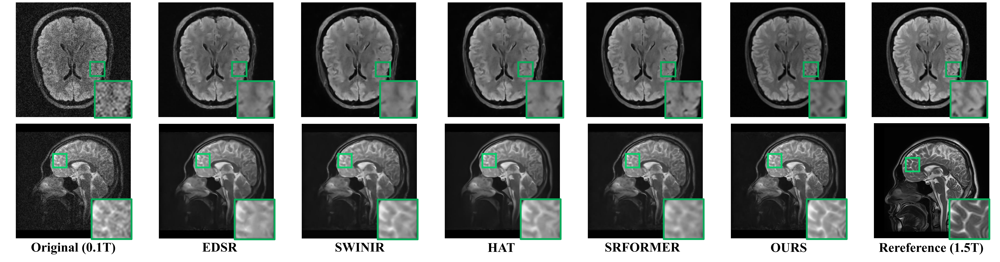
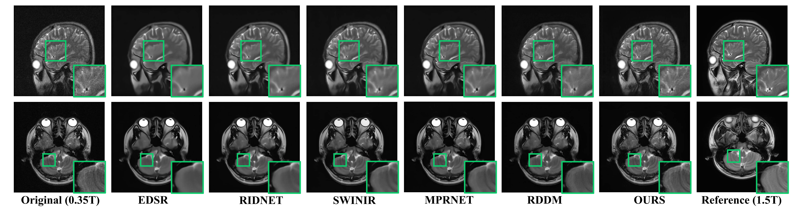

 # NAGNet: Measurement-Consistent Low-Field MRI Enhancement via k-Space Noise Modeling

<p align="center">
  
</p>

This repository contains the official PyTorch implementation of the paper:

> **Measurement-Consistent Low-Field MRI Enhancement via k-Space Noise Modeling**  
> *Yutao Hu, Qi Liu, Tao Zhou, Ziru Li, Ping Liang, Jichang Zhang, Rongsheng Lu, Xiaojian Lou, Jianjun Zheng, Jian Yang, Yang Chen*  


---

## 📌 Abstract

Low-field MRI has gained increasing attention as a cost-effective and portable alternative to high-field MRI. However, its inherently low magnetic field strength leads to reduced signal intensity and low SNR, resulting in severe image degradation. This work presents a **measurement‑consistent framework** that addresses three key aspects:

- **Data Synthesis** – physics‑inspired k‑space noise modeling with independent real/imaginary Gaussian injection.
- **Model Design** – a Noise‑Aware Guidance Network (NAGNet) with explicit spatially‑varying noise supervision.
- **Evaluation** – a unified benchmark including real paired acquisitions from 0.1 T, 0.35 T and 1.5 T scanners.

**Key contributions:**

- ✅ Physics‑based k‑space synthesis that preserves Fourier phase coherence.
- ✅ **Open‑release of real low‑field MRI datasets** (0.1 T, 0.35 T) with corresponding 1.5 T references from the same subjects.
- ✅ NAGNet with an Adaptive Noise Awareness (ANA) branch that explicitly estimates noise maps.
- ✅ State‑of‑the‑art performance across synthetic and real benchmarks.
- ✅ Strong generalisation to unseen field strengths (0.05 T, 0.1 T, 0.35 T) and different anatomical regions.

## 📂 Data Availability – **Open for Research**

**This is a core contribution of our work.** We are releasing the real‑world datasets that enable fair and reproducible benchmarking in low‑field MRI enhancement:

- **PriReL‑0.1 / PriReL‑0.35** – Real clinical brain scans acquired at 0.1 T and 0.35 T, together with **high‑field (1.5 T) references** from the same subjects (anatomically aligned but not perfectly registered). This is the **first publicly available** cross‑field paired dataset of its kind.


> **Data download** – The curated datasets will be uploaded to a public repository (link to be provided upon paper acceptance). Usage is restricted to **non‑commercial research purposes**; a detailed data use agreement will accompany the release.

## 🚀 Key Features

### 1. Measurement‑Consistent k‑Space Synthesis

Unlike image‑domain noise addition, our pipeline:

- Estimates noise variance from the **high‑frequency annular region** of real low‑field k‑space.
- Injects **independent Gaussian noise** into real and imaginary components.
- Preserves the complex‑valued signal statistics, maintaining phase consistency.
- 
📊 Results (as Reported in the Paper)
Quantitative Comparison (trained on PriSynL)
### Table 1: Quantitative Comparison (trained on PriSynL)
| Method | GN(im)  FID | GN(im)  LPIPS | IQT(im)  FID | IQT(im) LPIPS | Rician(im) FID | Rician(im) LPIPS | NC-χ²(im) FID | NC-χ²(im) LPIPS | GN(k-u)  FID | GN(k-u) LPIPS | Ours (k, real-imag, separated) FID | Ours (k, real-imag, separated) LPIPS |
|--------|------------------|--------------------|------------------|--------------------|----------------|------------------|---------------|------------------|------------------|--------------------|--------------------------------------|----------------------------------------|
| SWINIR  | 190.65 | 50.07 | 188.96 | 48.88 | 189.47 | 49.29 | 201.55 | 51.03 | 154.66 | 46.96 | 149.05 (-5.61) | 46.56 (-0.40) |
| HAT  | 184.69 | 49.17 | 180.70 | 49.92 | 194.65 | 50.06 | 213.65 | 50.69 | 168.38 | 48.55 | 161.28 (-7.10) | 47.71 (-0.81) |
| RDDM | 179.66 | 45.01 | 169.57 | 43.28 | 181.76 | 43.12 | 230.85 | 48.78 | 165.74 | 41.83 | 159.32 (-6.42) | 40.86 (-0.97) |
| NAGNet | 170.14 | 48.82 | 163.46 | 47.35 | 153.22 | 45.58 | 182.71 | 47.87 | 143.11 | 45.67 | 126.15 (-16.96) | 44.73 (-0.94) |

### 2. NAGNet Architecture
NAGNet consists of two synergistic paths:

Restoration backbone – reconstructs fine anatomical details.

Adaptive Noise Awareness (ANA) branch – a lightweight encoder‑decoder that predicts a spatially‑varying noise map.
The ANA branch is explicitly supervised by the known noise from k‑space synthesis, giving its output a clear physical meaning. It can be plugged into any restoration backbone to consistently improve denoising performance.

📊 Results (as Reported in the Paper)
Quantitative Comparison (trained on PriSynL)
### Table 2: Quantitative Comparison (trained on PriSynL)

### Table 2: Quantitative Comparison (trained on PriSynL)

| Method | PriSynL (PSNR↑/SSIM↑) | PriReL‑0.1 (LPIPS↓/FID↓) | PriReL‑0.35 (LPIPS↓/FID↓) |
|--------|------------------------|--------------------------|----------------------------|
| **General Restoration Model** | | | |
| RCAN | 31.05 / 82.48 | 46.71 / 149.27 | 39.63 / 117.45 |
| DBPN | 31.61 / 82.41 | 45.93 / 141.48 | 39.79 / 113.65 |
| EDSR | 31.34 / 82.74 | 46.68 / 153.29 | 40.85 / 126.92 |
| MSRGAN | 29.22 / 75.38 | 46.58 / 168.89 | 38.12 / 97.03 |
| MSRResNET | 30.76 / 77.41 | 46.65 / 145.28 | 40.78 / 120.62 |
| RIDNet | 31.87 / 83.44 | 46.15 / 148.66 | 38.49 / 97.51 |
| SwinIR | 31.77 / 83.36 | 46.56 / 149.05 | 38.54 / 90.29 |
| DAT | 29.02 / 77.46 | 50.37 / 198.81 | 42.06 / 138.61 |
| HAT | 31.31 / 83.71 | 47.71 / 161.28 | 38.69 / 95.04 |
| MPRNet | 31.71 / 87.28 | 46.90 / 165.01 | 38.17 / 88.29 |
| SRFormer | 31.78 / 87.55 | 46.28 / 160.19 | 38.14 / 86.58 |
| CTNET | 31.71 / 84.04 | 45.93 / 144.58 | 38.16 / 87.72 |
| DRCT | 31.32 / 80.41 | 46.81 / 152.83 | 38.53 / 95.68 |
| CLIPdn | 31.95 / 86.33 | 46.58 / 140.52 | 39.34 / 93.11 |
| **Low-field MRI Enhancement Model** | | | |
| CnDnCNN | 31.09 / 86.26 | 46.63 / 153.38 | 38.12 / 88.35 |
| DiffDeuR | 32.09 / 91.61 | 45.03 / 161.51 | 37.89 / 89.07 |
| SA-Cyclegan | 32.09 / 91.61 | 45.49 / 158.93 | 38.17 / 149.18 |
| **NAGNet** | **32.31 / 91.95** | **44.73 / 126.15** | **37.51 / 76.87** |
<p align="center">
  
</p>
Visual comparison of enhancement results across different methods. The images in first row and second row are selected
from PriSynL and PriReL-0.1, respectively, which are synthesized and real 0.1T low-field MRI images. Green boxes indicate
zoomed-in regions for detailed comparison. The rightmost column shows the corresponding 1.5T scan as a reference.
<p align="center">
  
</p>
Visual comparison of enhancement results of 0.35T low-field MRI across different methods. Green boxes indicate
zoomed-in regions for detailed comparison. The rightmost column shows the corresponding 1.5T scan as a reference.

## Environment
### Installation
```
pip install -r requirements.txt
python setup.py develop
```
