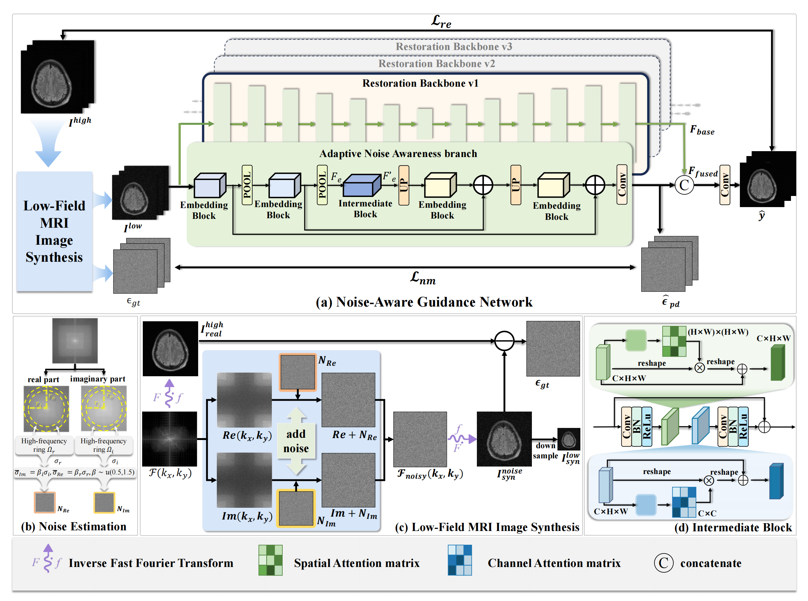

 # NAGNet: Measurement-Consistent Low-Field MRI Enhancement via k-Space Noise Modeling

<p align="center">
  
</p>

This repository contains the official PyTorch implementation of the paper:

> **Measurement-Consistent Low-Field MRI Enhancement via k-Space Noise Modeling**  
> *Yutao Hu, Qi Liu, Tao Zhou, Ziru Li, Ping Liang, Jichang Zhang, Rongsheng Lu, Xiaojian Lou, Jianjun Zheng, Jian Yang, Yang Chen*  


---

## 📌 Abstract

Low-field MRI has gained increasing attention as a cost-effective and portable alternative to high-field MRI. However, its inherently low magnetic field strength leads to reduced signal intensity and low SNR, resulting in severe image degradation. This work presents a **measurement‑consistent framework** that addresses three key aspects:

- **Data Synthesis** – physics‑inspired k‑space noise modeling with independent real/imaginary Gaussian injection.
- **Model Design** – a Noise‑Aware Guidance Network (NAGNet) with explicit spatially‑varying noise supervision.
- **Evaluation** – a unified benchmark including real paired acquisitions from 0.1 T, 0.35 T and 1.5 T scanners.

**Key contributions:**

- ✅ Physics‑based k‑space synthesis that preserves Fourier phase coherence.
- ✅ **Open‑release of real low‑field MRI datasets** (0.1 T, 0.35 T) with corresponding 1.5 T references from the same subjects.
- ✅ NAGNet with an Adaptive Noise Awareness (ANA) branch that explicitly estimates noise maps.
- ✅ State‑of‑the‑art performance across synthetic and real benchmarks.
- ✅ Strong generalisation to unseen field strengths (0.05 T, 0.1 T, 0.35 T) and different anatomical regions.

## 📂 Data Availability – **Open for Research**

**This is a core contribution of our work.** We are releasing the real‑world datasets that enable fair and reproducible benchmarking in low‑field MRI enhancement:

- **PriReL‑0.1 / PriReL‑0.35** – Real clinical brain scans acquired at 0.1 T and 0.35 T, together with **high‑field (1.5 T) references** from the same subjects (anatomically aligned but not perfectly registered). This is the **first publicly available** cross‑field paired dataset of its kind.


- **Data download** – To obtain the dataset, please use the following Baidu Cloud link. The extraction code is 6979.
https://pan.baidu.com/s/1SLa7e_V9jG0LbtsS4k-HVQ?pwd=6979


## How to train
Refer to ./options/train for the configuration file of the model to train.
The training command is like
```
python NAGNET/train.py -opt options/train/train_NAGNET_SRx2.yml --launcher pytorch
```
Before running the code, update the dataset paths in train_NAGNET_SRx2.yml and NAGNET_SRx2.yml so they match your local data locations.


## How to test
Refer to ./options/test for the configuration file of the model to train.
The training command is like
```
python NAGNET/train.py -opt options/test/NAGNET_SRx2.yml --launcher pytorch
```
Before running the code, update the dataset paths in train_NAGNET_SRx2.yml and NAGNET_SRx2.yml so they match your local data locations.


## 🧪 Noise Simulation: Quick Start

If you have real raw k‑space data, then we provide two functions in NAGNet/data/simulation.py to generate realistic low‑field MRI data following our k‑space real‑imag separated approach.
### Batch generation
Use the command‑line script to generate a full dataset:

```
python NAGNET/data/generate_synthetic.py 
    --high_field_dir /path/to/1.5T/data \
    --real_ref_dir /path/to/0.1T/reference \
    --output_dir ./data/PriSynL \
    --num_slices 24000 \
    --scale 0.5
```


## Environment
### Installation
```
pip install -r requirements.txt
python setup.py develop
```
##

